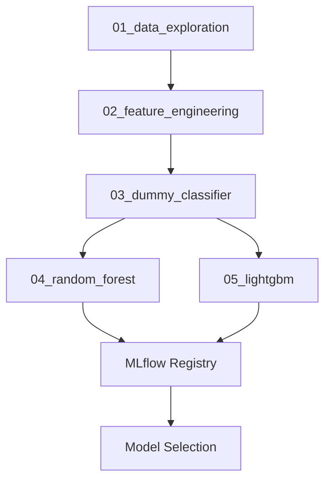

# Credit Scoring MLOps Project

A comprehensive credit scoring system with full MLOps pipeline for "Prêt à dépenser" financial company.

## Project Overview

This project implements an automated credit scoring system that:
- Predicts the probability of client default
- Classifies loan applications as approved or rejected
- Provides model interpretability (global and local feature importance)
- Implements a complete MLOps pipeline

## Project Structure

```
├── data/
│   ├── input/          # Raw data files
│   ├── processed/      # Processed datasets
│   └── features/       # Engineered features
├── src/
│   ├── data/           # Data processing modules
│   ├── models/         # Best model to be used for deployement
│   ├── api/            # FastAPI application
│   └── utils/          # Utility functions
├── tests/              # Unit tests
├── config/             # Configuration files
├── notebooks/          # Jupyter notebooks (see below)
├── models/             # Trained models
└── rapports/           # Reports and documentation
```

## Notebooks

The project includes the following Jupyter notebooks in the `notebooks/` directory:

| Notebook | Description |
|----------|-------------|
| `01_data_exploration.ipynb` | Initial data exploration and analysis. Identifies class imbalance and data quality issues. |
| `02_feature_engineering.ipynb` | Feature engineering from 7 data sources. Creates 700+ features and saves to `data/processed/features_train.pkl`. |
| `03_dummy_classifier.ipynb` | Baseline model using DummyClassifier. Establishes minimum performance thresholds with 5-fold CV. |
| `04_random_forest.ipynb` | Random Forest training with 5-fold CV and Optuna hyperparameter tuning. |
| `05_lightgbm.ipynb` | LightGBM training with 5-fold CV and Optuna hyperparameter tuning. |
| `01_mlflow_setup.ipynb` | MLflow setup demo showing how to use the `notebook_mlflow.py` utility. |

### Notebook Workflow



### Training Pipeline

1. **Data Exploration** (`01_data_exploration.ipynb`): Understand data and identify issues
2. **Feature Engineering** (`02_feature_engineering.ipynb`): Create 700+ features, save to pickle
3. **Baseline** (`03_dummy_classifier.ipynb`): Establish baseline metrics with DummyClassifier
4. **Random Forest** (`04_random_forest.ipynb`): Train RF with CV, tune with Optuna
5. **LightGBM** (`05_lightgbm.ipynb`): Train LGBM with CV, tune with Optuna
6. **Model Selection**: Compare models in MLflow UI, select best for deployment

### Data Splits

All model training notebooks use consistent data splits for fair comparison:
- **Train**: 60% (for training and cross-validation)
- **Validation**: 20% (for model comparison)
- **Test**: 20% (reserved for final evaluation)

### Evaluation Methodology

- **Cross-Validation**: 5-fold stratified CV for robust metrics
- **Primary Metric**: AUC-ROC (ranking capability)
- **Business Metric**: Cost = 10×FN + 1×FP (False Negatives cost 10x more)
- **Optimal Threshold**: Found by minimizing business cost

## Key Features

- **Machine Learning**: Binary classification with class imbalance handling
- **Business Metrics**: Custom cost function (FN cost = 10x FP cost)
- **MLOps**: MLFlow tracking, model registry, and serving
- **API**: REST API with probability and classification endpoints
- **Interpretability**: SHAP for global and local feature importance
- **CI/CD**: GitHub Actions for automated deployment
- **Testing**: Comprehensive unit tests with pytest

## Setup

1. **Create virtual environment:**
   ```bash
   uv venv
   source .venv/bin/activate
   ```

2. **Install dependencies:**
   ```bash
   uv pip install -r requirements.txt
   ```

3. **Run MLFlow tracking server:**
   ```bash
   mlflow ui
   ```

## Usage

### Training Models
```bash
python src/models/train.py
```

### Starting API
```bash
uvicorn src.api.main:app --reload
```

### Testing API
```bash
streamlit run src/api/streamlit_app.py
```

## MLOps Pipeline

1. **Experiment Tracking**: MLFlow for model versioning and metrics
2. **Model Registry**: Centralized model storage and management
3. **Model Serving**: MLFlow serving for production deployment
4. **CI/CD**: GitHub Actions for automated testing and deployment
5. **Monitoring**: Data drift detection and model performance monitoring

## Business Context

- **Target**: Binary classification (default/no default)
- **Class Imbalance**: Handle imbalance between good and bad clients
- **Cost Function**: FN cost = 10x FP cost
- **Threshold Optimization**: Find optimal decision threshold
- **Performance Target**: AUC > 0.82 (beware of overfitting)

## Dataset

The project uses a hierarchical dataset with multiple related tables:
- `application_train.csv` / `application_test.csv`: Main application data
- `bureau.csv`: Previous loans from other institutions
- `previous_application.csv`: Previous Home Credit applications
- `bureau_balance.csv`: Monthly credit bureau balances
- `POS_CASH_balance.csv`: Monthly POS and cash loan balances
- `credit_card_balance.csv`: Monthly credit card balances
- `installments_payments.csv`: Payment history

## License

This project is part of the OpenClassrooms Data Science curriculum.
